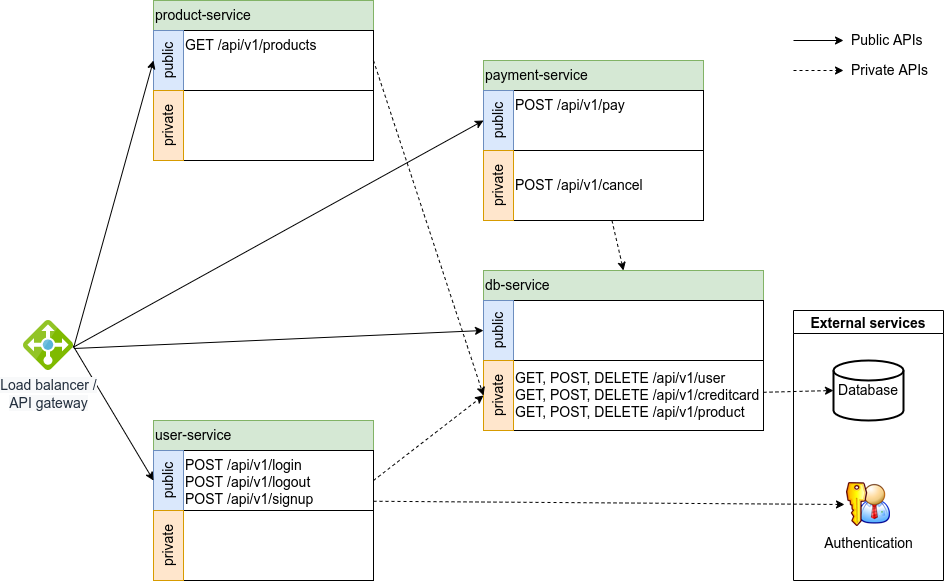
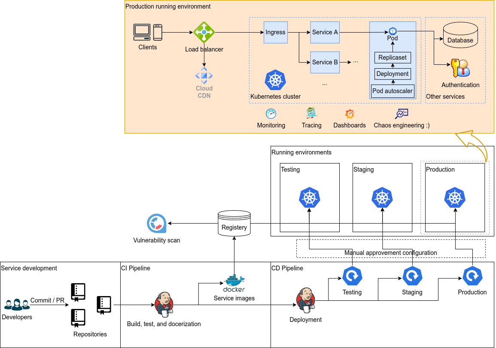

# Deployment pipeline for a microservice-based e-shop application

## Application

Here we use an e-shop application that contains several micro-services as an example. Each service exposes a set of APIs, some of which are public while the others are for internal use only. The application uses a database for data storage.

### Service list:

- user-service
  - POST /api/v1/login (public)
  - POST /api/v1/logout (public)
  - POST /api/v1/signup (public)
- product-service
  - GET /api/v1/products (public)
- payment-service
  - POST /api/v1/pay (public)
  - POST /api/v1/cancel (internal)
- db-service
  - GET, POST, DELETE /api/v1/user (internal)
  - GET, POST, DELETE /api/v1/creditcard (internal)
  - GET, POST, DELETE /api/v1/product (internal)

### Production environment requirements

- People can access this application via a domain name such as www.happyshopping.com
- The payment service needs to support different vendors like Visa, Mastercard, AMEX, etc
- It should be fast
- It should be secure
- It should have high availability
- It should be able to scale based on workloads
- It must run within Kubernetes cluster

## Dependencies of the micro-services

In order to design a proper deployment arcthitecture, we need to analyze the dependencies of these micro-services. The figure above denotes the dependencies of both internal services and external services. Though it is not mentioned in the service list, I think both a load balancer/API gateway and some external services like database and a central authentication service are necessary.

## Thoughts of the production environment requirements

According to the production environment requirements mentioned above, here are some thoughts about how to meet them.

> People can access this application via a domain name such as www.happyshopping.com

This is related to certificate management and ingress. For example, one can deploy NginxIngress to K8s to achieve the goal.

> The payment service needs to support different vendors like Visa, Mastercard, AMEX, etc

I am not familiar with integrating these payment services, but I think they can be considered as external services. Thus the configuration of calling such services, security consideration, database transactions, queues might be needed here.

> It should be fast

Improving the performance can be discussed in different directions. As a SRE, I think scalability

> It should be secure

At the infrastructure level, the security of K8s or other cloud services should be discussed. At the network level, attacks like DDOS should be monitored. At the application level, HTTPS should always be used for API calls. Certificate management should be well designed to avoid expiration issues.

> It should have high availability

Thanks to the features of K8s, ReplicaSet can be used to deploy a certain number of each microservice. Usually different regions and zones can be used for deploying the same application globally. Load balancers, health check, and CDN are also helpful for an application's availablity.

> It should be able to scale based on workloads

As K8s is the running environment, horizontal pod autoscaling could be applied here.

> It must run within Kubernetes cluster

Smart choice :) So each micro-service's developers should provide Dockerfiles in their code base, which can be used for building images in a CI/CD pipeline. There should be several supporting services as well, such as docker registeries and image analysis, etc.

## Proposed deployment architecture

Based on the thoughts above, here is the proposed deployment architecture. I am not sure if this is too abstract or too detailed. Here are some explanations about the figure.

A deployment procedure starts from the bottom-left corner of the figure, when developers create a commit or a PR to their project repo. Here we can use tools like Jenkins or Google Cloud Build (if the infrastructure is running on top of GCP) to set up CI/CD pipelines to build and test a micro-service. Since the application is running on K8s, the CI/CD pipeline builds micro-service Docker images and pushes them to a Docker registery, such as DockerHub and GCP Container Registry.

Before updating the running services using new images, it is good to scan these images for vulnerabilities.

Based on tag name, branch, or specific flags in a commit message, we can deploy the updated micro-services to a specific running environment, like testing environment, staging environment, or production environment.

In the figure, the production running environment is selected for demonstrating a bit more details, though this part may not belong to the **deployment architecture** per se. The point I would like to mention here is that we still need to consider the production environment when designing the deployment architecture.

Based on the production running environment, a deployment manifest should include the following components in a K8s yaml file.

- K8s deployments
- K8s services which expose ports of different micro-services
- K8s ingress
- K8s horizontal pod autoscaler

Additionally, consider that the system should be fast and highly available, the same deployment procedure should be done at different regions and zones (using GCP's terms as an example).

## TODO
- [x] architecture with diagrams and explanations
- [ ] K8s manifest files
